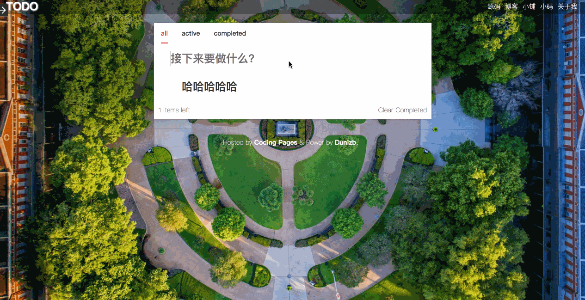

### 慕课网 - Vue+Webpack打造todo应用

此源码基于 [慕课网](https://www.imooc.com/) Jokcy老师的 [Vue+Webpack打造todo应用](https://www.imooc.com/learn/935) 视频教程编写，所用到的模块包均为当前最新版本

### 预览

### 技术点
- webpack4.0
- 在Vue中写JSX
- tabs，notification组件的封装
- 背景壁纸每日更新Bing壁纸
- 国际化化支持（正在开发...）

### 开始
- 安装NPM依赖：`npm install`
- 启动项目：`npm run dev`
- 启动项目打包：`npm run build`

**预览网址**：[https://demo.dunizb.com/list/vue-todo/](https://demo.dunizb.com/list/vue-todo/)
